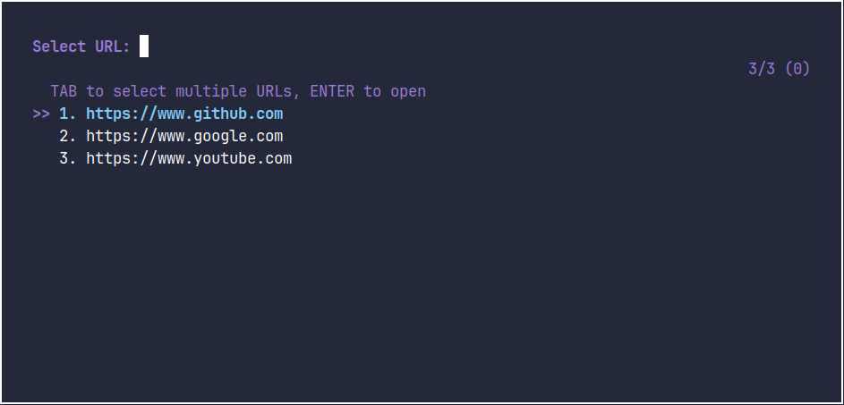

# Tmux QuickURL

[](#)
[](#)
[](#)

A simple tmux plugin that helps you quickly open URLs from a predefined list using fzf.

## Preview



## Requirements

- [tmux](https://github.com/tmux/tmux)
- [fzf](https://github.com/junegunn/fzf)
- [tpm](https://github.com/tmux-plugins/tpm)
- xdg-open (usually pre-installed on Linux)

## Installation

### Using TPM (recommended)

Add this line to your `~/.tmux.conf`:

```tmux
set -g @plugin 'merkksgit/tmux-quickurl'
```

Press `prefix` + `I` to install the plugin.

Add this line to your `~/.tmux.conf`:

```tmux
run-shell ~/.tmux/plugins/tmux-quickurl/tmux-quickurl.tmux
```

## Update with TPM

Press `prefix` + `U` (capital U) to update this plugin along with other TPM plugins.

## Usage

1. Create or edit `~/.quickurls` file
2. Add your URLs, one per line. For example:

```
https://www.github.com
https://www.google.com
https://www.youtube.com
```

3. Press `prefix` + `u` to open the URL picker
4. Select a URL using fzf
5. The URL will open in your default browser

## URL File Format

- The URL file should be located at `~/.quickurls`
- Each URL should be on its own line
- URLs should be complete with protocol (e.g., 'https://')
- No additional text or descriptions needed - just the URLs
- Empty lines will be ignored

## Configuration

You can change the default key binding in your `.tmux.conf`:

```tmux
set -g @quickurl-key 'U'  # Changes the key binding to prefix + U
```

## Debugging

The plugin logs activity to `/tmp/url_opener.log` to help troubleshoot issues. This log includes:

- Session start timestamps
- URL selections
- URL opening attempts
- xdg-open outputs and errors

If you experience any issues like tmux freezes or URLs not opening, check this log file for error messages.

## License

[MIT License](https://mit-license.org/)
